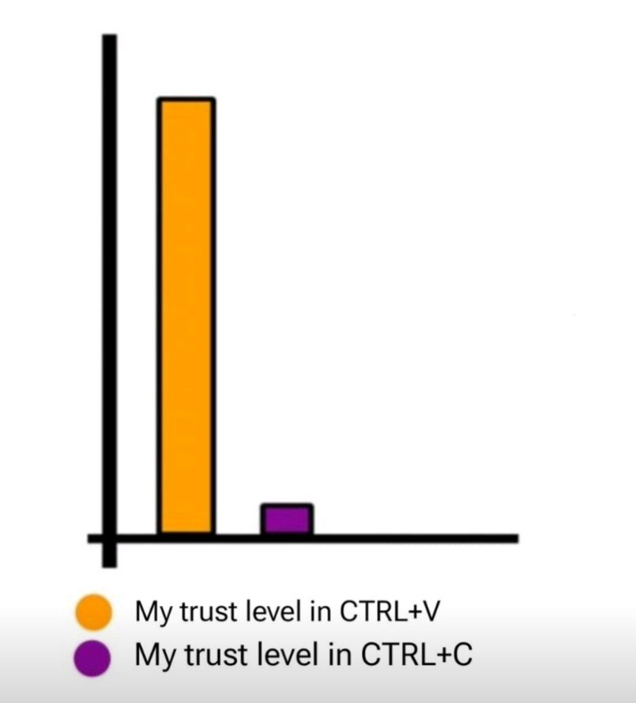

# Clipwatch
Provides toast notifications on windows when a CTRL+C copy to clipboard is successful

## Why was this made?
Because I posted this in the MonoGame discord

Which sparked a conversation on Windows needing to notify when a copy is successful, so I said why the hell not.

## License
This is licensed under the Unlicense.  Refer to the [LICENSE](./LICENSE) file for license text.
